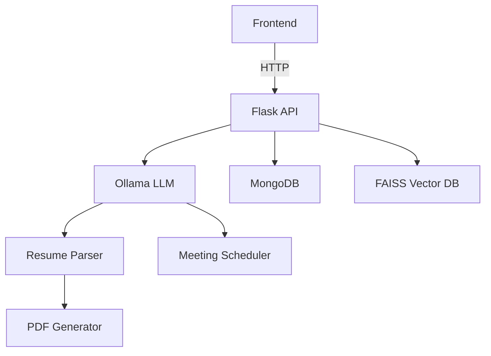

# RecruitAI - AI-Powered Recruitment Assistant


RecruitAI revolutionizes recruitment workflows by combining AI-powered resume parsing with intelligent meeting scheduling in a single, integrated platform.

## 🌟 Features

### 📄 Smart Resume Processing
- **Multi-format Support**: PDF, DOCX
- **Resume Overview**:
  - Personal details (name, contact info)
  - Professional experience with timeline reconstruction
  - Education history with institution recognition
  - Skills matrix with proficiency estimation
  - Project portfolio analysis
- **AI Classification**: Automatic categorization by job role
- **AI Interviewer Suggesion**: Suggest best interviewer according to Resume
- **PDF Generation**: Professional commen template-based resume creation

### 📅 Intelligent Scheduling
- Natural language meeting request interpretation
- Calendar integration capabilities
- Automated participant notifications by mail

### 📊 Recruitment Analytics
- Candidate comparison dashboard
- Skill gap analysis
- Pipeline visualization

## 🏗️ System Architecture



## 🛠️ Installation Guide

### Prerequisites
- Python 3.9+
- Node.js 16+ (for frontend)
- MongoDB 5.0+
- Ollama (with at least 8GB VRAM)

### Backend Setup

```bash
# Clone repository
git clone https://github.com/ritigit7/RecruitAI-Assistant.git
cd RecruitAI-Assistant/RecruitAI

# Create and activate virtual environment
python -m venv .venv
source .venv/bin/activate  # Windows: .venv\Scripts\activate

# Install dependencies
pip install -r requirements.txt

# Set up MongoDB (ensure service is running)
sudo systemctl start mongod

# Initialize Ollama
ollama pull llama3.2
ollama serve &

# Launch backend
python flask_api.py
```

### Frontend Setup

```bash
cd RecruitAI
npm install
npm run dev
```

## 📡 API Documentation

### Base URL
`http://localhost:5000/api/v1`

### All Endpoints

| Endpoint                             | Method | Description                                  | Parameters                                  |
|--------------------------------------|--------|----------------------------------------------|---------------------------------------------|
| `/`                                  | GET    | Renders the index page                        | -                                           |
| `/parse_resume`                      | POST   | Parses a resume file                          | `file`: Uploaded file (PDF or DOCX)         |
| `/schedule_meeting`                   | POST   | Schedules a meeting based on provided text    | JSON: `{'text': '...'}`                       |
| `/get_last_resume`                   | GET    | Retrieves the personal details of the last parsed resume | -                                           |
| `/generate_person_resume/<resume_id>` | GET    | Generates a PDF for a specific resume ID     | `resume_id`: ID of the resume to generate  |
| `/get_resumes`                       | GET    | Retrieves a list of all saved resumes        | -                                           |
| `/get_meetings`                      | GET    | Retrieves a list of all saved meetings        | -                                           |
| `/get_interviewers`                  | GET    | Retrieves a list of all interviewer data      | -                                           |
| `/resumes/professional_resume.pdf`   | GET    | Views the generated professional resume PDF   | -                                           |
| `/generate_resume_pdf`               | POST   | Generates and sends the professional resume PDF as a download | -                                           |
| `/send-email`                        | POST   | Sends emails to specified recipients          | JSON: `{'recipients': [...], 'subject': '...', 'text': '...', 'html': '...'}` |
| `/save_resume`                       | POST   | Generates and saves the resume PDF           | -                                           |

## 🧩 Configuration

Environment variables (`.env`):

```ini
MONGO_URI=mongodb://localhost:27017
OLLAMA_MODEL=llama3.2
UPLOAD_FOLDER=./uploads
LOG_LEVEL=INFO
```

## 📂 Project Structure

```
RecruitAI/
├── RecruitAI/              # Backend services
│   ├── api/                # API routes
│   ├── core/               # Business logic
│   ├── models/             # Data models
│   ├── services/           # External integrations
│   ├── utils/              # Helper functions
│   ├── tests/              # Unit tests
│   └── flask_api.py        # App entry point
├── src/                    # Frontend React app
│   ├── public/             # Static assets
│   ├── src/
│   │   ├── components/     # UI components
│   │   ├── pages/          # Application views
│   │   ├── services/       # API clients
│   │   └── styles/         # CSS modules
│   └── vite.config.ts      # Build config
├── docs/                   # Documentation
└── scripts/                # Deployment scripts
```
## 📂 Project UI


## 🧪 Example Usage

### Parse Resume via CLI

```bash
curl -X POST -F "file=@john_doe_resume.pdf" \
http://localhost:5000/api/v1/resumes
```

Response:
```json
{
  "_id": {
    "$oid": "67eec59fa8b1ee4015ff526b"
  },
  "filename": "Varun Kumar.docx",
  "parsed_data": {
    "Personal_Details": {
      "Full_Name": "Varunkumar",
      "Email_Address": "varunkumar.work@gmail.com",
      "Phone_Number": "+6016510507",
      "City": "Plano",
      "State": "TX",
      "Country": "USA"
    },
    "Professional_Summary": {
      "Summary": "Highly experienced software developer with over 8 years of experience in developing business-to-business and business-to-client applications using various architectures such as Two-tier, Three-tier, and N-tier. Skilled in Java, J2EE, and Spring technologies.",
      "Years_of_Experience": 8,
      "Industry_Focus": [
        "Telecom",
        "Finance",
        "E-Commerce"
      ]
    },
    "Skills_Details": {
      "Programming_Languages": [
        "Java",
        "J2EE",
        "JavaScript",
        "HTML",
        "CSS",
        "SQL"
      ],
      "Frameworks_Libraries": [
        "Spring",
        "Angular JS"
      ]
    },
    "Work_Experience": {
      "list_of_experience": [
        {
          "company": "Varunkumar",
          "title": "Full Stack Java Developer",
          "duration": "Jan 2016 - May 2017"
        },
        {
          "company": "Capital One",
          "title": "Full Stack Java Developer",
          "duration": "Jan 2016 - May 2017"
        }
      ]
    }
  }
}
```

### Schedule Meeting via API

```python
import requests

response = requests.post(
    "http://localhost:5000/api/v1/meetings",
    json={
        "text": "Interview with Jane Smith for ML position next Tuesday 2-3pm"
    }
)
print(response.json())
```

## 🤝 Contributing

1. Fork the repository
2. Create your feature branch (`git checkout -b feature/amazing-feature`)
3. Commit your changes (`git commit -m 'Add some amazing feature'`)
4. Push to the branch (`git push origin feature/amazing-feature`)
5. Open a Pull Request

## 📬 Contact

**Project Maintainer**: Ritik  
**Email**: ritikm01092003@gmail.com  
**GitHub**: [@ritigit7](https://github.com/ritigit7)
```
